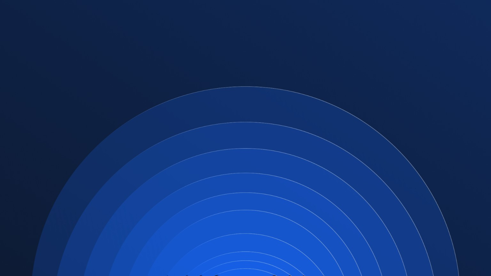

<div align="center">
  

  <h1>Velaris</h1>

  <p><strong>Arch Linux refined for performance, stability, and a clean KDE Plasma experience.</strong></p>

  <p>
    <a href="https://github.com/Caeluum/velaris/releases">Downloads</a>
    ·
    <a href="https://github.com/Caeluum/velaris/actions">Builds</a>
    ·
    <a href="https://github.com/Caeluum/velaris/issues">Issues</a>
    ·
    <a href="https://github.com/Caeluum">Caelum</a>
  </p>

  <p>
    
    
    
    
  </p>

  <a href="https://github.com/Caeluum/velaris/actions/workflows/build.yml">
    
  </a>
</div>

<br>

<p align="center">
  
</p>

> [!IMPORTANT]
> Velaris is under active development. All currently available images are **Beta** releases. Back up your data and test the installer in a virtual machine or on secondary hardware before using it on a production system.

## About Velaris

**Velaris** is an Arch-based Linux distribution created by [Caelum](https://github.com/Caeluum). It combines the CachyOS kernel, KDE Plasma 6, and a carefully configured software selection to provide a fast, responsive, and predictable desktop.

The project does not rely on unmeasured, aggressive tweaks. Every decision should preserve compatibility, security, and stability, especially on systems with limited memory or slower storage.

## Project pillars

| | Pillar | Goal |
|---|---|---|
| ⚡ | **Balanced performance** | Improve responsiveness, memory management, and interactive workloads without sacrificing stability. |
| 🛡️ | **Reliable foundation** | Use conservative defaults, an available firewall, and protection against memory exhaustion. |
| ✨ | **Clean Plasma desktop** | Deliver an organized and modern KDE Plasma 6 environment without unnecessary applications or services. |
| 🧩 | **Compatibility** | Support AMD and Intel hardware, multiple file systems, PipeWire, and familiar installation tools. |
| 🔧 | **Open development** | Keep the system profile, build scripts, and technical decisions available for review and contribution. |

## Core stack

| Component | Technology |
|---|---|
| Base | Arch Linux |
| Kernel | `linux-cachyos` |
| Desktop | KDE Plasma 6 |
| Display manager | SDDM |
| Audio | PipeWire + WirePlumber |
| Networking | NetworkManager |
| Interactive shell | Fish |
| Init system | systemd |
| Bootloader | GRUB with UEFI and legacy BIOS support |
| Installer | Calamares |
| Default file system | Btrfs, with Ext4 and XFS available |

## Features

- CachyOS kernel focused on interactive workloads and desktop responsiveness.
- ZRAM to reduce the impact of memory pressure.
- zswap explicitly disabled to avoid compressing the same memory twice.
- Ananicy C++, `irqbalance`, GameMode, and `earlyoom` integrated into the profile.
- Fish with native autosuggestions and syntax highlighting, plus Fastfetch once per login session.
- CUPS socket activation and scheduled package-cache maintenance.
- Btrfs Zstd level 1 compression for new Calamares installations.
- KDE Plasma 6 with animations and effects adjusted for a more direct experience.
- PipeWire for audio, video, and compatibility with modern applications.
- Support for Btrfs, Ext4, XFS, NTFS, exFAT, LUKS, and LVM.
- Live environment with Calamares for a straightforward graphical installation.
- Automated builds and reproducible local builds with ArchISO.

## Download

Published images are available on the [Releases](https://github.com/Caeluum/velaris/releases) page. When a checksum file is provided with an ISO, verify the download before writing it to a USB drive:

```bash
sha256sum -c velaris-*.iso.sha256
```

> [!WARNING]
> Do not download Velaris images published by accounts or websites that are not linked to the Caelum organization.

## Installation

1. Download the latest ISO and its checksum.
2. Write the image to a USB drive with a trusted imaging tool.
3. Boot the computer from the USB drive in UEFI or legacy BIOS mode.
4. Test networking, audio, graphics, and storage from the live environment.
5. Open Calamares and carefully review the partition layout before confirming the installation.

The installer is still being stabilized, so always keep an up-to-date backup of important files.

## Build the project

### Arch Linux, CachyOS, or Codespaces

```bash
git clone https://github.com/Caeluum/velaris.git
cd velaris
sudo ./build.sh
```

The ISO and its SHA-256 checksum will be written to the `out/` directory.

### Docker

```bash
docker build -t velaris-builder .devcontainer/
docker run --rm --privileged \
  -v "$(pwd)":/workspace \
  -w /workspace \
  velaris-builder \
  ./build.sh
```

> [!NOTE]
> ArchISO must mount file systems during the build process. For that reason, the container runs in privileged mode.

## Branches

| Branch | Purpose |
|---|---|
| [`main`](https://github.com/Caeluum/velaris/tree/main) | Main public project baseline. |
| [`agent/velaris-stability-lenovo-runner`](https://github.com/Caeluum/velaris/tree/agent/velaris-stability-lenovo-runner) | Stability, Calamares, validation, and `lenovo-server` runner work. |

## Repository structure

```text
velaris/
├── .devcontainer/       # Container-based development and build environment
├── .github/workflows/   # GitHub Actions automation
├── assets/              # Visual identity used by the documentation
├── profile/             # ArchISO and live system profile
│   ├── airootfs/        # Files copied into the root file system
│   ├── efiboot/         # UEFI boot configuration
│   ├── grub/            # GRUB and legacy BIOS configuration
│   ├── packages.x86_64  # Packages included in the image
│   ├── pacman.conf      # Repositories used during the build
│   └── profiledef.sh    # Main ArchISO profile definition
└── build.sh             # Main build entry point
```

Development branches may also contain additional documentation and validators before they are integrated into `main`.

## Roadmap

- Fully stabilize Calamares and its partitioning scenarios.
- Measure boot time, idle memory usage, responsiveness, and installed size.
- Improve the separation between live-session and installed-system packages.
- Review Plasma services through safe and reversible profiles.
- Expand hardware, virtual machine, UEFI, legacy BIOS, and encryption testing.
- Prepare the first official stable Velaris release.

## Contributing

Bug reports and contributions are welcome:

1. Check the [existing issues](https://github.com/Caeluum/velaris/issues).
2. Open an issue with relevant logs, hardware information, and clear reproduction steps.
3. For code changes, create a focused branch in your fork and submit a pull request.
4. Never include keys, tokens, passwords, personal images, or other private data in logs.

## Credits

Velaris is developed by **Caelum** and built upon the work of the [Arch Linux](https://archlinux.org/), [CachyOS](https://cachyos.org/), [KDE](https://kde.org/), and [Calamares](https://calamares.io/) communities.

This is an independent project and is not officially endorsed by the upstream projects listed above.

<div align="center">
  <sub>Built by <a href="https://github.com/Caeluum">Caelum</a> · Performance, stability, and freedom.</sub>
</div>
